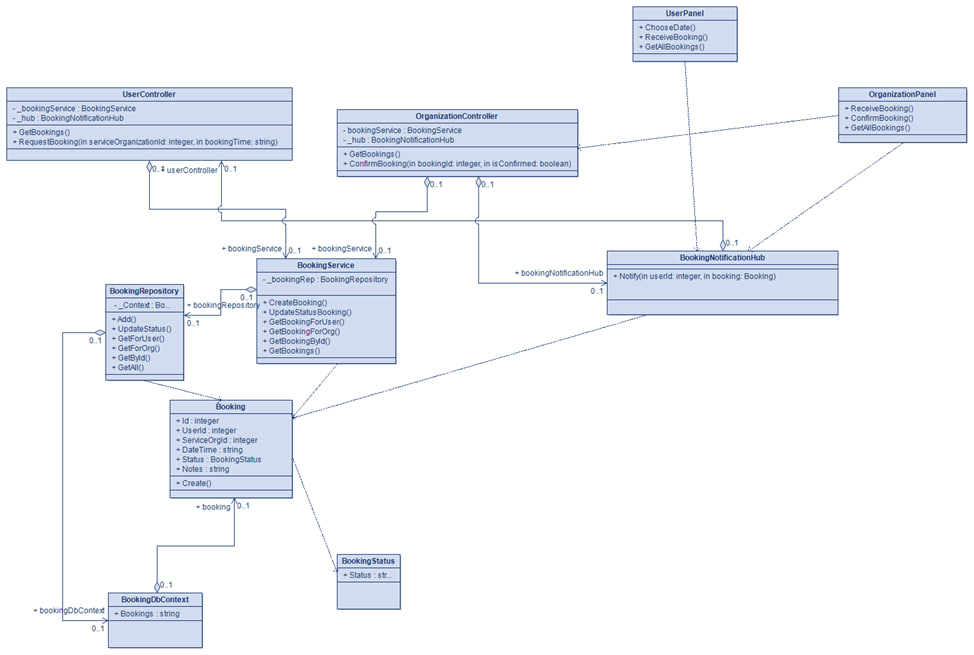
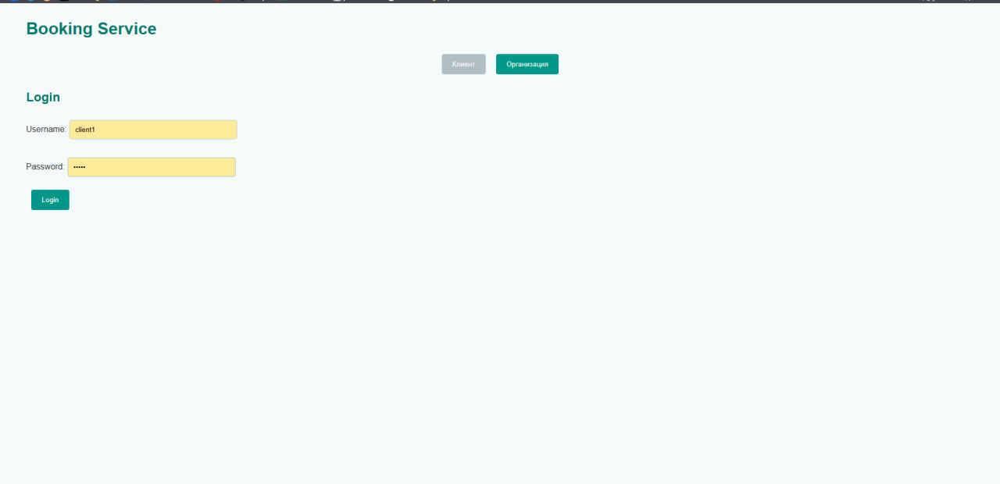
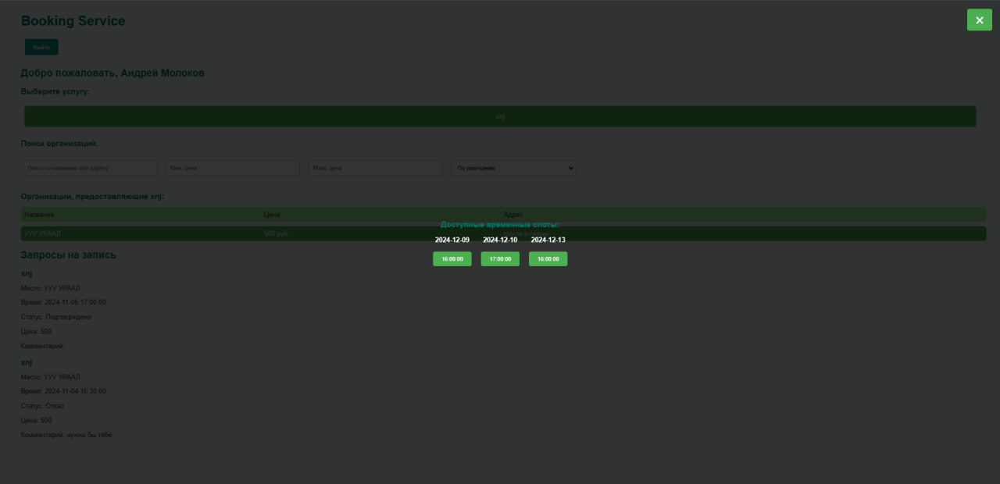
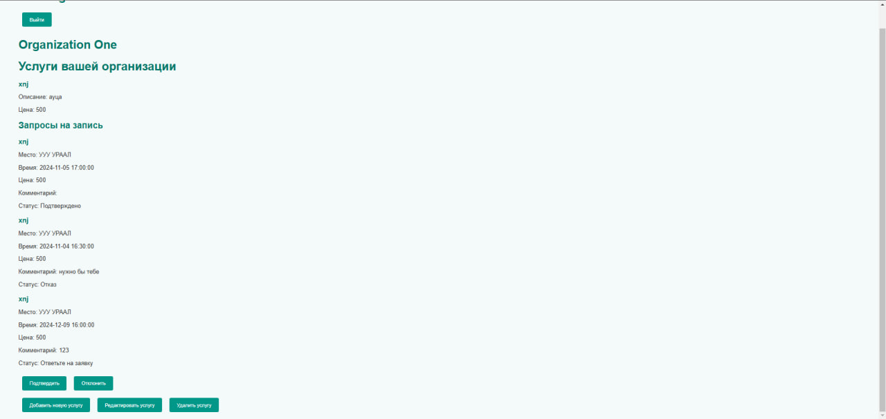
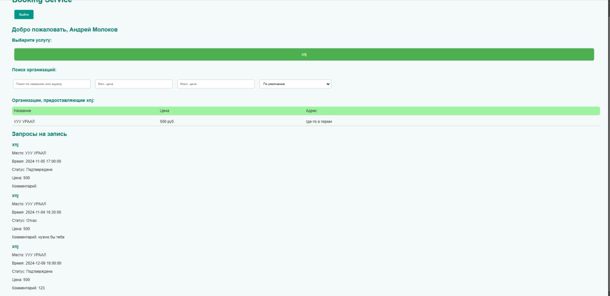

# Бронирование времени для автомойки. Попытка в микросервисы

* [О проекте](#AboutProject)

## О проекте
Разделено на три микросервиса: бронирование, услуги и расписание(не выделили, но можно вынести). 
Сделано на бэке все очень так себе по ему мнению, пропущены многие проверки и тд.

- моментальное оповещения - SignalR
- для дальнейшего CI/CD - docker
- onion архитектура

Надо было везде юзать DTO, нормалньо сделаь мапперы, хотелось в DDD и почекать CQRS. Но вышло, что вышло. Делалось очень быстро

### Фоточки:
#### Спроектированная диаграмма классов для брони

#### Выбор организация/пользователь

#### Выбор услуги и доступного ремени организации пользователем

#### Моментальное оповещение организации

#### Моментальное оповещение пользователя
	

